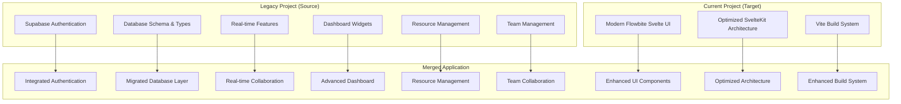
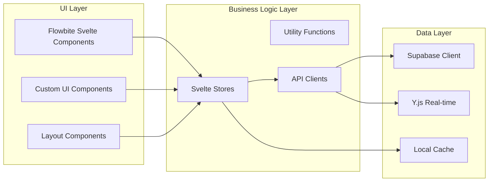
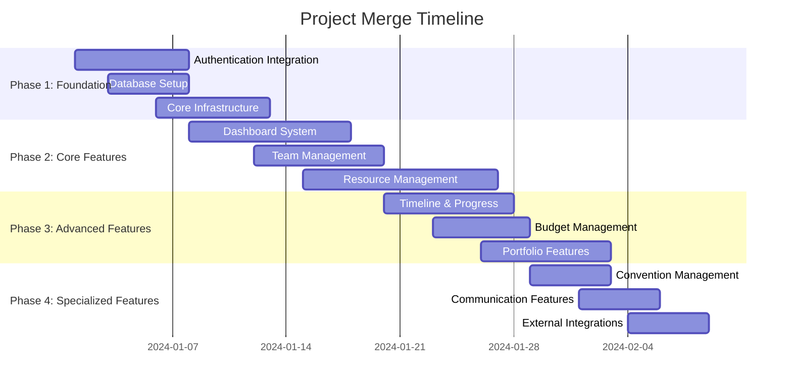

# Project Merge Design Document

## Overview

This document outlines the technical design for merging the comprehensive Cosplans application functionality into the current SvelteKit project while preserving the modern UI/UX design and optimized architecture.

## Architecture

### High-Level Architecture



### Component Architecture



## Components and Interfaces

### Authentication System

#### Component Structure
```typescript
// Authentication Components
src/lib/components/auth/
├── LoginForm.svelte          // Modern UI login form
├── RegisterForm.svelte       // Modern UI registration form
├── PasswordResetForm.svelte  // Password reset with modern UI
├── OAuthButtons.svelte       // OAuth provider buttons
└── AuthGuard.svelte         // Route protection component

// Authentication Stores
src/lib/auth/
├── auth-store.ts            // Migrated from legacy project
├── auth-utils.ts            // Migrated authentication utilities
└── types.ts                 // Migrated type definitions
```

#### Interface Design
```typescript
interface AuthenticationService {
  // Core authentication methods
  signIn(credentials: LoginCredentials): Promise<AuthResult>
  signUp(data: SignupData): Promise<AuthResult>
  signOut(): Promise<void>
  resetPassword(email: string): Promise<void>
  
  // OAuth methods
  signInWithOAuth(provider: OAuthProvider): Promise<AuthResult>
  
  // Session management
  getSession(): Promise<Session | null>
  refreshSession(): Promise<Session | null>
}
```

### Dashboard System

#### Widget Architecture
```typescript
// Dashboard Components
src/lib/components/dashboard/
├── DashboardLayout.svelte      // Main dashboard container
├── WidgetContainer.svelte      // Individual widget wrapper
├── widgets/
│   ├── UpcomingShootsWidget.svelte
│   ├── ProgressWidget.svelte
│   ├── TasksWidget.svelte
│   ├── TimelineWidget.svelte
│   ├── BudgetWidget.svelte
│   └── WeatherWidget.svelte
└── WidgetCustomizer.svelte     // Widget configuration UI
```

#### Widget Interface
```typescript
interface DashboardWidget {
  id: string
  type: WidgetType
  position: number
  visible: boolean
  settings: WidgetSettings
  template: DashboardTemplate
}

interface WidgetComponent {
  widget: DashboardWidget
  teamId: string
  onUpdate?: (data: any) => void
  onError?: (error: Error) => void
}
```

### Resource Management System

#### Resource Architecture
```typescript
// Resource Components
src/lib/components/resources/
├── characters/
│   ├── CharacterList.svelte
│   ├── CharacterForm.svelte
│   └── CharacterDetail.svelte
├── costumes/
│   ├── CostumeList.svelte
│   ├── CostumeForm.svelte
│   └── CostumeDetail.svelte
├── props/
├── equipment/
├── wigs/
└── shared/
    ├── ResourceSearch.svelte
    ├── ResourceFilter.svelte
    └── ResourceCard.svelte
```

#### Resource Interface
```typescript
interface ResourceManager<T extends Resource> {
  // CRUD operations
  create(data: Partial<T>): Promise<T>
  read(id: string): Promise<T | null>
  update(id: string, data: Partial<T>): Promise<T>
  delete(id: string): Promise<void>
  
  // Query operations
  list(filters?: ResourceFilters): Promise<T[]>
  search(query: string): Promise<T[]>
  
  // Relationship operations
  linkToCharacter(resourceId: string, characterId: string): Promise<void>
  unlinkFromCharacter(resourceId: string, characterId: string): Promise<void>
}
```

### Event Management System

#### Event Architecture
```typescript
// Event Management Components
src/lib/components/events/
├── EventList.svelte          // Convention and event listing
├── EventForm.svelte          // Event creation and editing
├── EventDetail.svelte        // Event details and logistics
├── ConventionPlanner.svelte  // Convention-specific planning
└── EventCalendar.svelte      // Calendar integration

// Event Types
interface Event {
  id: string
  name: string
  type: 'convention' | 'photoshoot' | 'meetup' | 'competition'
  start_date: string
  end_date: string
  location: Location
  costumes: Costume[]
  team_id: string
  status: 'planning' | 'confirmed' | 'completed'
}
```

### Photoshoot Management System

#### Photoshoot Architecture
```typescript
// Photoshoot Components
src/lib/components/photoshoots/
├── PhotoshootList.svelte     // Shoot listing and status
├── PhotoshootForm.svelte     // Shoot planning and creation
├── PhotoshootDetail.svelte   // Detailed shoot management
├── CrewManager.svelte        // Crew assignment and contact
├── LocationScout.svelte      // Location management
└── WeatherWidget.svelte      // Weather integration

// Photoshoot Types
interface Photoshoot {
  id: string
  title: string
  date: string
  location: Location
  crew: CrewMember[]
  equipment: Equipment[]
  costumes: Costume[]
  weather_conditions?: WeatherData
  status: 'planning' | 'scheduled' | 'in_progress' | 'completed'
}
```

### Social Media Integration System

#### Social Media Architecture
```typescript
// Social Media Components
src/lib/components/social/
├── ContentCalendar.svelte    // Content planning calendar
├── InstagramManager.svelte   // Instagram integration
├── PostScheduler.svelte      // Post scheduling interface
├── CaptionTemplates.svelte   // Template management
├── HashtagManager.svelte     // Hashtag organization
├── AnalyticsDashboard.svelte // Engagement analytics
└── ContentApproval.svelte    // Team approval workflow

// Social Media Types
interface SocialMediaPost {
  id: string
  platform: 'instagram' | 'tiktok' | 'twitter'
  content: string
  caption: string
  hashtags: string[]
  scheduled_date?: string
  published_date?: string
  status: 'draft' | 'scheduled' | 'published'
  analytics?: PostAnalytics
}

interface ContentCalendar {
  posts: SocialMediaPost[]
  shoots: Photoshoot[]
  events: Event[]
  content_pillars: ContentPillar[]
}
```

### Real-time Collaboration

#### Real-time Architecture
```typescript
// Real-time Components
src/lib/stores/realtime/
├── realtime-store.ts        // Y.js integration
├── collaboration-store.ts   // User presence and cursors
├── sync-store.ts           // Offline sync management
└── conflict-resolution.ts   // Operational transformation

// Real-time Types
interface RealtimeUpdate {
  type: UpdateType
  entityId: string
  userId: string
  timestamp: string
  data: unknown
}
```

## Data Models

### Core Entities

#### User and Team Models
```typescript
interface User {
  id: string
  email: string
  first_name?: string
  last_name?: string
  avatar_url?: string
  created_at: string
  updated_at: string
}

interface Team {
  id: string
  name: string
  description?: string
  owner_id: string
  members: TeamMember[]
  created_at: string
  updated_at: string
}
```

#### Resource Models
```typescript
interface Character {
  id: string
  name: string
  series: string
  source_medium: SourceMedium
  team_id: string
  costumes: Costume[]
  props: Prop[]
  wigs: Wig[]
  accessories: Accessory[]
  created_at: string
  updated_at: string
}

interface Costume {
  id: string
  name: string
  character_id: string
  version?: string
  complexity_rating: number
  estimated_cost: number
  progress: number
  tasks: Task[]
  photos: Photo[]
  created_at: string
  updated_at: string
}
```

#### Dashboard Models
```typescript
interface DashboardWidget {
  id: string
  type: WidgetType
  user_id: string
  template: DashboardTemplate
  position: number
  visible: boolean
  settings: Record<string, unknown>
  created_at: string
  updated_at: string
}

interface ProgressTracker {
  shoot_id: string
  costume_progress: number
  props_progress: number
  location_progress: number
  team_progress: number
  overall_progress: number
  outstanding_tasks: Task[]
  updated_at: string
}
```

## Error Handling

### Error Architecture
```typescript
// Error Handling System
src/lib/utils/errors/
├── error-types.ts          // Custom error classes
├── error-handler.ts        // Global error handler
├── validation-errors.ts    // Form validation errors
└── api-errors.ts          // API error handling

// Error Types
class AuthenticationError extends Error {
  constructor(message: string, public code: string) {
    super(message)
    this.name = 'AuthenticationError'
  }
}

class ResourceNotFoundError extends Error {
  constructor(resourceType: string, id: string) {
    super(`${resourceType} with id ${id} not found`)
    this.name = 'ResourceNotFoundError'
  }
}
```

### Error Handling Strategy
1. **Client-side Validation**: Form validation using Zod schemas
2. **API Error Handling**: Consistent error responses from Supabase
3. **User Feedback**: Toast notifications and error states in UI
4. **Logging**: Comprehensive error logging for debugging
5. **Fallback UI**: Graceful degradation for failed components

## Testing Strategy

### Test Architecture
```typescript
// Testing Structure
tests/
├── unit/
│   ├── auth/              // Authentication unit tests
│   ├── stores/            // Store unit tests
│   ├── utils/             // Utility function tests
│   └── components/        // Component unit tests
├── integration/
│   ├── dashboard/         // Dashboard integration tests
│   ├── resources/         // Resource management tests
│   └── realtime/          // Real-time feature tests
└── e2e/
    ├── auth-flow.spec.ts  // Authentication E2E tests
    ├── dashboard.spec.ts  // Dashboard E2E tests
    └── resources.spec.ts  // Resource management E2E tests
```

### Testing Approach
1. **Unit Tests**: Test individual components and utilities
2. **Integration Tests**: Test component interactions and data flow
3. **E2E Tests**: Test complete user workflows
4. **Visual Regression**: Ensure UI consistency during migration
5. **Performance Tests**: Validate performance metrics are maintained

## Migration Strategy

### Phase-based Migration


### Component Migration Process
1. **Analysis**: Identify components to migrate
2. **UI Modernization**: Update to Flowbite Svelte components
3. **Logic Extraction**: Separate business logic from UI
4. **Integration**: Connect to existing stores and APIs
5. **Testing**: Validate functionality and UI consistency
6. **Optimization**: Ensure performance standards are met

## Performance Considerations

### Optimization Strategies
1. **Code Splitting**: Lazy load feature modules
2. **Bundle Optimization**: Maintain current bundle size targets
3. **Database Optimization**: Efficient queries and caching
4. **Real-time Optimization**: Minimize WebSocket overhead
5. **Image Optimization**: Compress and resize images automatically

### Performance Metrics
- **Initial Load**: < 3 seconds
- **Bundle Size**: < 500KB gzipped
- **Time to Interactive**: < 2 seconds
- **Real-time Latency**: < 100ms
- **Database Query Time**: < 200ms average

## Security Considerations

### Security Architecture
1. **Authentication**: Supabase Row Level Security (RLS)
2. **Authorization**: Role-based access control (RBAC)
3. **Data Validation**: Server-side validation with Zod
4. **API Security**: Rate limiting and input sanitization
5. **File Upload**: Secure file handling and virus scanning

### Security Measures
- **HTTPS Enforcement**: All communications encrypted
- **CSRF Protection**: Cross-site request forgery prevention
- **XSS Prevention**: Content Security Policy (CSP)
- **SQL Injection**: Parameterized queries only
- **File Security**: Type validation and size limits